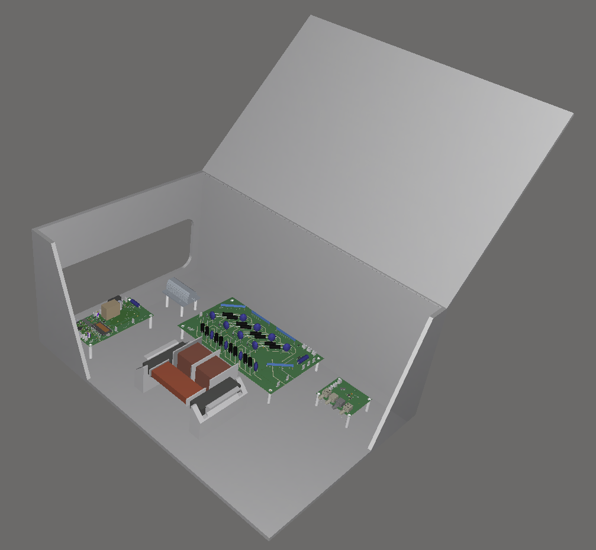
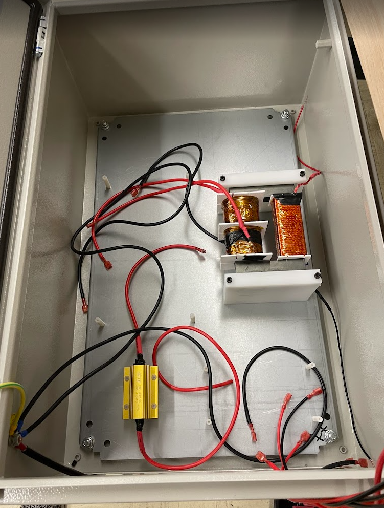
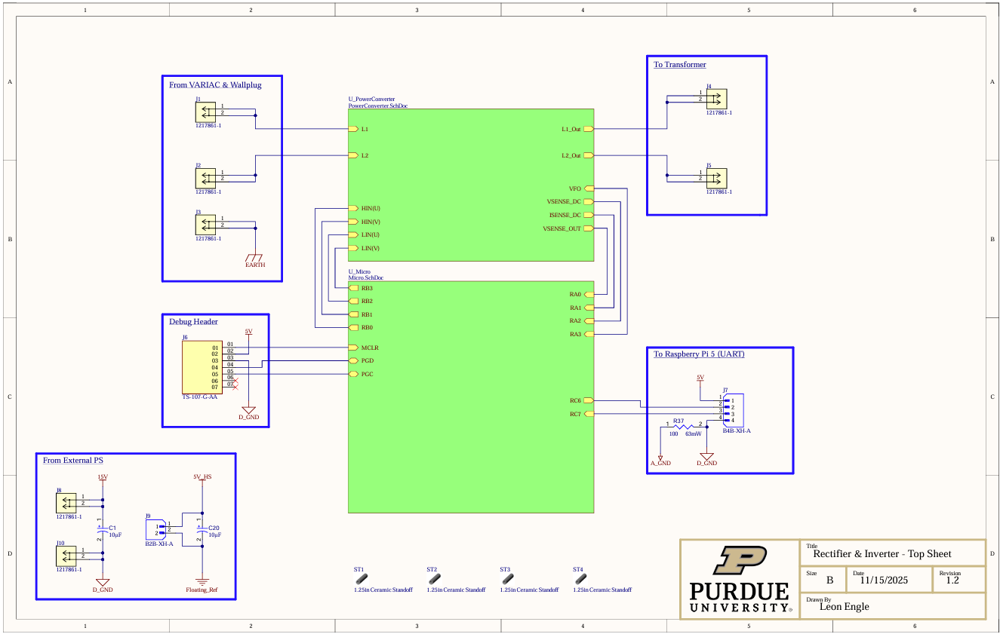
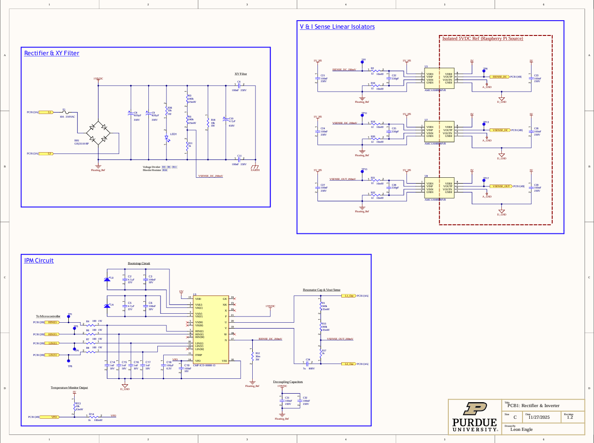
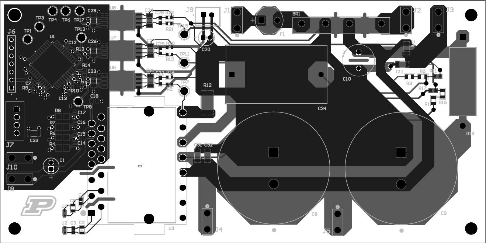
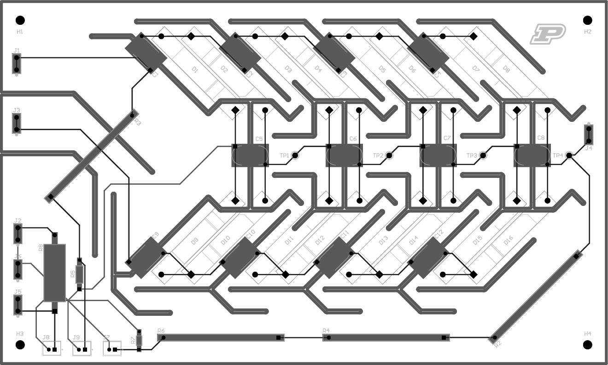
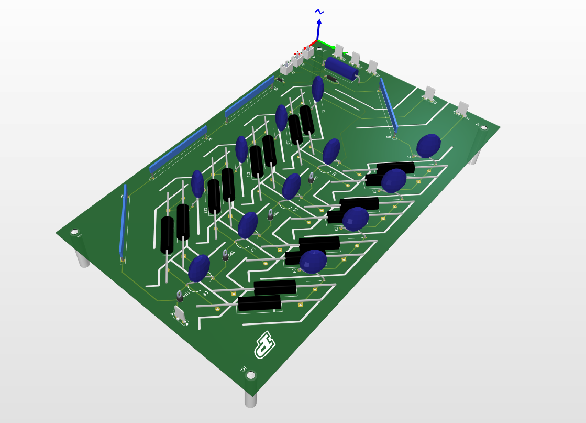

# Farnsworth_Fusor_PowerSystem
## Contributors
1) 
## Overview
Here we present a design for a 400W 120VrmsAC 60Hz -> 33kVDC Power Converter; to power an automated Farnsworth Fusor. Relevant Power Converter control I/Os are configured to be digitally accessible by a host computer to enable remote control & monitoring. 

The power converter has four stages: a passive rectifier, an inverter (18kHz) driven by complementary PWM, a ferrite UU core 1:30 transformer, and an 8x voltage multiplier. So far, we have achieved 1kVDC output with 8.5VpAC input using the transformer and multiplier stages, while we wait on the inverter-rectifier PCB. There are four PCBs in the design, described below. 

Photos of the full assembly in Altium CAD software and current status of build:

   

## PCB1: Passive Rectifier & 18kHz Inverter
### Top-Level Schematic
 

### Rectifier & Inverter Schematic
 

### Microcontroller Schematic
 

### PCB - 2D & 3D View
   

## PCB2: 8x Voltage Multiplier, V&I Sense
### Top-Level Schematic
 

### PCB - 2D & 3D View
   

## PCB3: DAQ1 & Fiber-Optic SPI Node

## PCB4: Raspberry Pi 5 <-> Fiber-Optic SPI Node, DAQ2 & UART Node
